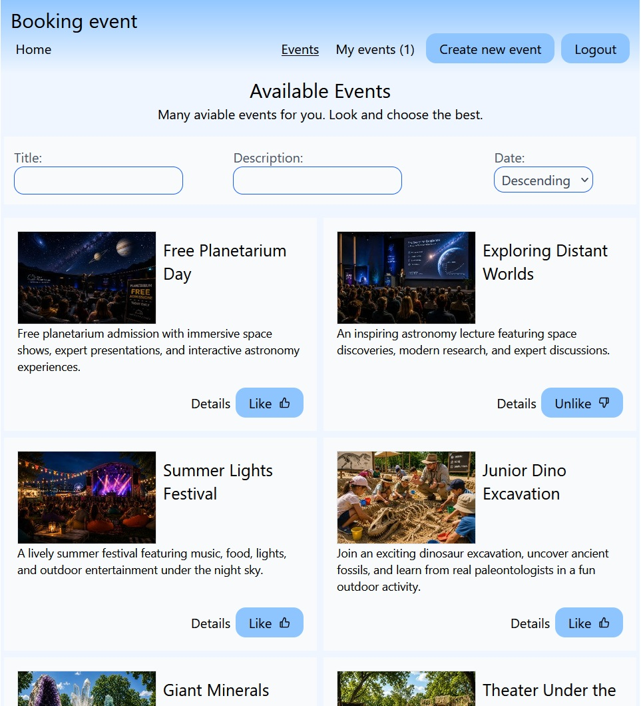
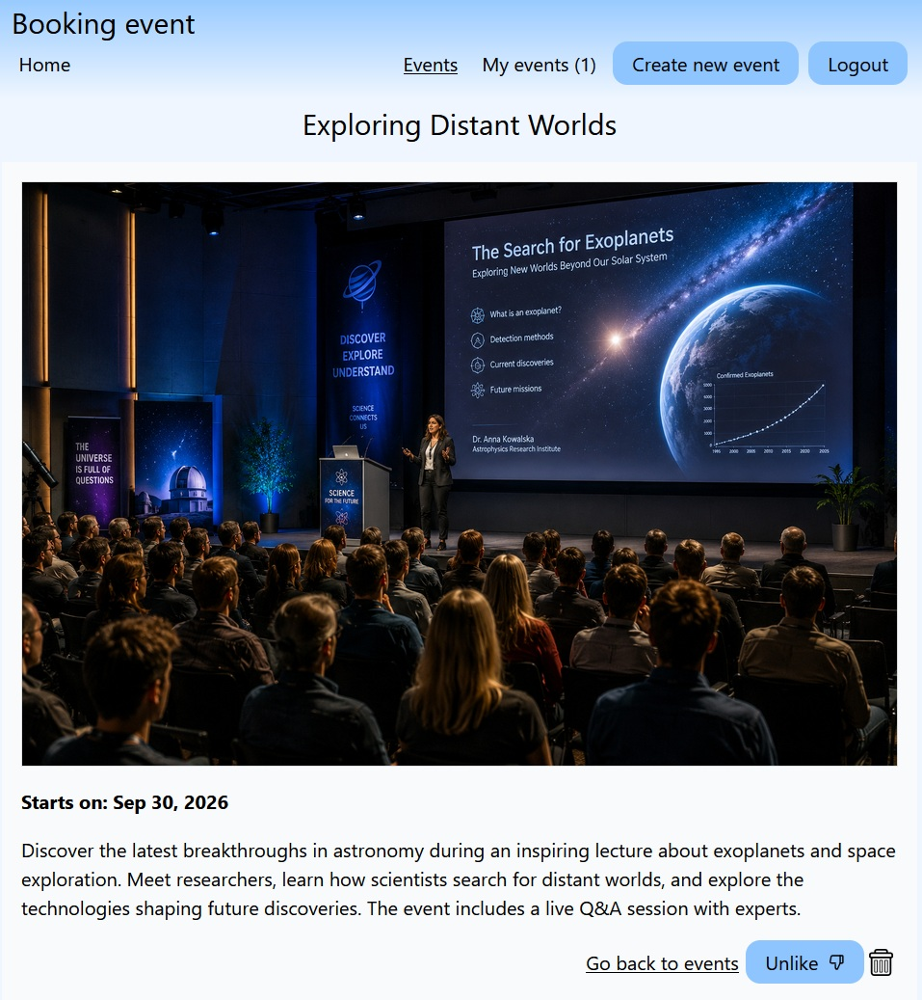
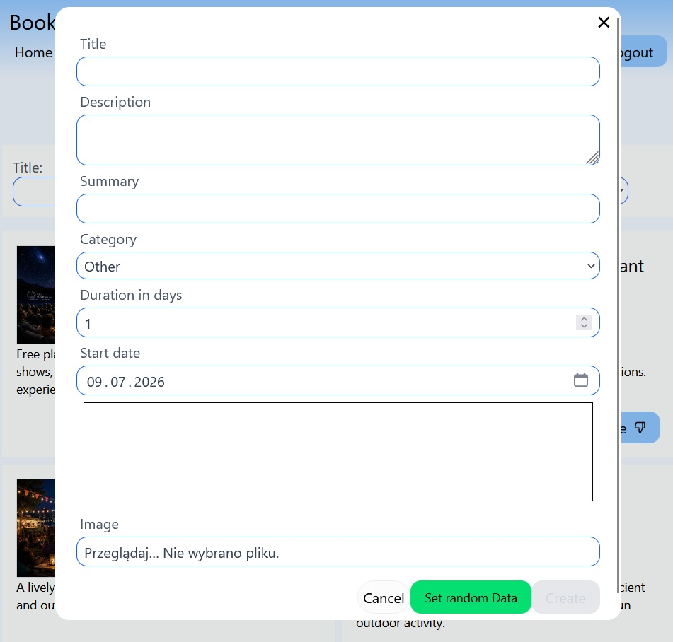
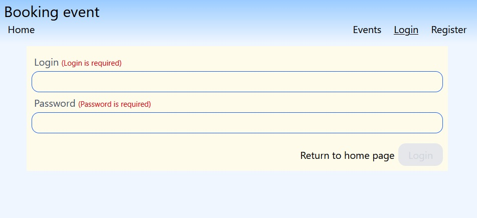

App on live:
https://book-session-ruby.vercel.app/

test user with admin privileges: test@test.pl / 123456


# Events

A full-stack event discovery and booking application built with React and TypeScript. The application allows users to browse, search, create, manage, and like events.

The project demonstrates modern frontend development practices, including server-state management, optimistic updates, infinite scrolling, runtime validation, authentication, database security with Row Level Security, and automated testing.

## Live Demo

**Live application:**
`https://book-session-ruby.vercel.app/`

**GitHub repository:**
`http://github.com/wojtekrother/book-session`

---

## Screenshots

### Events List

The main dashboard displays events using infinite scrolling and allows users to search and filter available events.



### Event Details

Detailed information about a selected event.



### Create Event

Authenticated users with appropriate permissions can create new events.



### Search and Filtering

Users can search events and change the sorting order.


### Authentication

User authentication powered by Supabase Auth.



---

## Features

* Browse available events
* Infinite scrolling with pagination
* Search and filtering
* Event details view
* User authentication
* Create, update and delete events
* Soft delete support
* Like and unlike events
* Optimistic UI updates
* Loading skeletons
* Error handling
* Responsive layout
* Runtime API response validation
* Row Level Security for database access
* Automated unit, component and integration tests

---

## Tech Stack

### Frontend

* React 18
* TypeScript
* Vite
* Tailwind CSS
* React Router

### Data Fetching and State Management

* TanStack Query
* Infinite queries
* Mutations
* Optimistic updates
* Query cache invalidation

### Backend and Database

* Supabase
* PostgreSQL
* Supabase Authentication
* Supabase Storage
* Row Level Security policies

### Validation

* Zod

### Testing

* Vitest
* React Testing Library
* User Event
* jsdom

---

## Testing

The project includes different levels of automated tests.

### Zod Schema Tests

Validation tests verify:

* valid event data,
* invalid field values,
* missing required fields.

### EventItem Component Tests

Component tests verify:

* required event information is displayed,
* optional information is hidden when appropriate,
* UI behavior for authenticated and unauthenticated users,
* Like and Unlike button states,
* user interactions.

### EventsListPage Integration Tests

Integration tests verify:

* rendering events returned by the API,
* empty list state,
* loading skeletons,
* API error handling.

Run tests with:

```bash
npm test
```

Run tests in watch mode:

```bash
npm run test:watch
```

---

## Architecture

The application separates responsibilities between:

* UI components
* feature-specific components
* custom React hooks
* API services
* TanStack Query hooks
* Zod schemas
* reusable UI components

Example project structure:

```text
src/
├── features/
│   └── event/
│       ├── hooks/
│       ├── list/
│       └── schema/
├── services/
│   └── api/
├── shared/
│   └── components/
└── utils/

tests/
├── eventSchema.test.ts
├── EventItem.test.tsx
├── EventListPage.test.tsx
├── setup.tsx
└── test-utils.tsx
```

---

## Data Fetching

TanStack Query is used for server-state management.

The application includes:

* query caching,
* infinite queries,
* mutations,
* optimistic updates,
* query invalidation,
* loading and error states,
* AbortSignal support.

---

## Infinite Scrolling

Events are loaded incrementally using:

* `useInfiniteQuery`
* Supabase range pagination
* `IntersectionObserver`

Loading skeletons provide visual feedback while additional events are being fetched.

---

## Authentication and Authorization

Authentication is handled by Supabase Auth.

Database access is protected using PostgreSQL Row Level Security policies.

RLS policies control operations such as:

* reading events,
* creating events,
* updating events,
* deleting events,
* liking and unliking events.

Authorization rules are enforced at the database level rather than relying only on frontend checks.

---

## API Validation

Responses returned from the backend are validated at runtime using Zod schemas.

This provides additional protection against unexpected API response structures and keeps runtime data consistent with TypeScript types.

---

## Getting Started

Clone the repository:

```bash
git clone [YOUR_REPOSITORY_URL]
cd book-session
```

Install dependencies:

```bash
npm install
```

Create an environment file:

```text
.env
```

Add your Supabase configuration:

```text
VITE_SUPABASE_URL=your_supabase_url
VITE_SUPABASE_ANON_KEY=your_supabase_anon_key
```

Start the development server:

```bash
npm run dev
```

---

## Available Scripts

```bash
npm run dev
```

Starts the Vite development server.

```bash
npm run build
```

Runs TypeScript compilation and creates a production build.

```bash
npm test
```

Runs the Vitest test suite.

```bash
npm run test:watch
```

Runs tests in watch mode.

```bash
npm run lint
```

Runs ESLint.

---

## Deployment

The frontend is deployed using Vercel.

The backend infrastructure is provided by Supabase, including:

* PostgreSQL database,
* authentication,
* storage,
* Row Level Security.

---

## Future Improvements

Possible future improvements include:

* accessibility improvements,
* expanded test coverage,
* end-to-end tests,
* improved UI design,
* additional event filters,
* monitoring and error tracking.

---

## Author

Developed as a portfolio project demonstrating practical knowledge of modern React development, TypeScript, server-state management, backend integration, database security, and automated testing.
